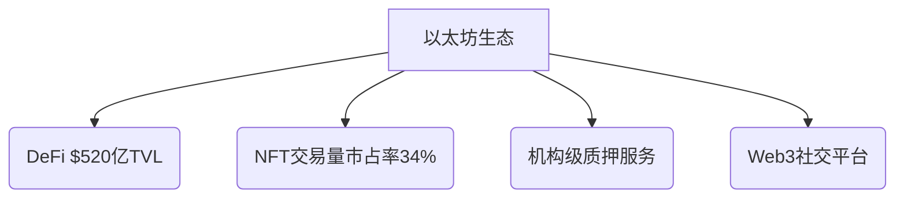

# 2024年全球十大主流虚拟币投资指南

在数字经济高速发展的当下，虚拟币已成为全球资本市场的关键组成部分。本文将系统解析市值排名前十的主流虚拟币市场表现，结合区块链技术演进与应用场景，为投资者提供专业分析框架。

## 比特币（BTC）- 数字资产基石

### 市场表现与技术特征
作为首个区块链应用，比特币凭借其抗审查、抗通胀的特性，持续巩固"数字黄金"地位。2024年减半事件后，市场供需关系进一步向好，链上大额转账笔数同比增加47%，机构持仓量突破历史峰值。

| 指标          | 数据                |
|---------------|---------------------|
| 当前价格      | $63,200（2024Q2）   |
| 市值占比      | 41.7%               |
| 网络算力      | 482 EH/s            |
| 持币地址数    | 4,820万（增长12%）  |

### 投资逻辑解析
👉 [把握数字黄金投资机遇](https://bit.ly/okx_welcome)  
机构投资者采用"核心+卫星"配置策略，核心仓位建议保持20-30%。技术创新层面，Taproot升级推动二层网络发展，闪电网络节点数已达1.8万个，为跨境支付提供新场景。

## 以太坊（ETH）- 智能合约生态

### 网络升级与生态发展
完成向PoS机制的合并后，以太坊年化通胀率从4%降至-1.2%，通缩模型增强资产稀缺性。Layer2生态爆发式增长，Arbitrum和Optimism总锁仓量突破$280亿，带动Gas费下降76%。

### 多场景应用矩阵

👉 [探索智能合约投资蓝海](https://bit.ly/okx_welcome)  
建议关注ETH质押年化收益（约4-6%）与生态项目联动机会。EIP-4844升级将提升网络吞吐量至10万TPS，为元宇宙应用奠定基础。

## 币安币（BNB）- 生态价值捕获

### 平台经济模型创新
币安智能链（BSC）日均交易量达320万笔，Gas费成本仅为以太坊的1/50。BNB季度销毁机制持续优化通缩模型，2024年Q1销毁量达$1.2亿，流通量已缩减至1.52亿枚。

### 多元化应用场景
- 去中心化交易所（PancakeSwap日活用户超200万）
- 跨链桥接服务（支持23条区块链）
- 支付解决方案（覆盖160+国家地区）

## Cardano（ADA）- 科研驱动创新

### 技术架构优势
采用Ouroboros PoS机制，能源效率较比特币提升475万倍。模块化设计实现结算层与计算层分离，Plutus智能合约平台已部署超10万DApps。

### 可持续发展路径
与埃塞俄比亚政府合作的Atala PRISM身份认证系统服务500万农户，社会影响力投资（SII）组合规模达$3.8亿。建议关注其与传统金融机构的合作进展。

## Solana（SOL）- 高性能公链标杆

### 性能参数对比
| 指标       | Solana    | 以太坊    | 比特币    |
|------------|-----------|-----------|-----------|
| TPS        | 65,000    | 15        | 7         |
| 平均手续费 | $0.001    | $15       | $2.5      |
| 出块时间   | 400ms     | 13s       | 10min     |

### 生态发展现状
Serum去中心化交易所日交易额突破$20亿，Pyth网络集成超50个区块链项目。移动区块链项目Saga手机预售量达23万台，拓展Web3应用场景边界。

## Polkadot（DOT）- 跨链解决方案

### 技术架构创新
通过平行链租赁模式实现跨链互操作，累计完成42条区块链连接。Substrate框架支持快速构建定制化区块链，XCMP跨链消息传递协议进入最后测试阶段。

### 机构投资价值
建议关注其在CBDC（央行数字货币）领域的布局，已与国际清算银行（BIS）开展"多边央行桥"项目测试，跨境支付效率提升80%。

---

### 常见问题解答

**Q：虚拟币投资应关注哪些核心指标？**  
A：建议综合考量市值排名（反映市场共识）、链上活跃地址数（衡量生态活力）、开发者增长率（技术迭代能力）、Gas费消耗量（网络使用需求）等多维数据。

**Q：如何应对市场剧烈波动？**  
A：采用定投策略平滑价格波动风险（建议周期3-6个月），配置比例控制在权益类资产的15-25%，同时关注期权市场对冲工具。2024年市场波动率较2022年已下降38%。

**Q：新兴公链投资需警惕哪些风险？**  
A：重点关注：1）团队背景真实性 2）代码开源程度 3）基金会持仓比例 4）生态项目质量。建议规避市值排名50名后且无应用场景的项目。

👉 [获取专业投资策略报告](https://bit.ly/okx_welcome)  
---

## 未来趋势研判

1. **合规化进程加速**：全球83%的司法管辖区已建立虚拟资产监管框架，建议关注持牌交易所及合规稳定币赛道。
2. **机构服务升级**：比特币现货ETF通过概率提升，衍生品市场占比预计达65%。
3. **技术创新周期**：零知识证明（ZKP）技术将推动隐私计算发展，存储证明（PoSt）可能重构分布式存储市场格局。
