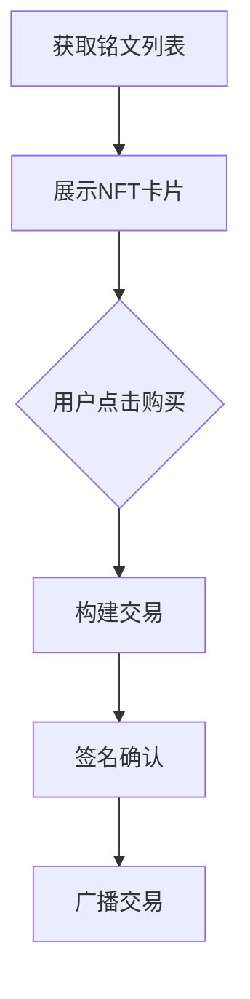

# OKX Injected Provider API 全面解析：比特币钱包接入与 DEX 开发指南

## 一、Inject Provider API 核心价值
OKX Injected Providers API 基于 JavaScript 构建，作为 Web3 开发者连接区块链生态的关键桥梁。该接口通过浏览器插件钱包集成，为 DApp 项目提供账户信息获取、链上数据读取、交易签名等基础能力，支持构建去中心化交易所、NFT 市场等区块链应用。

👉 [立即体验区块链开发利器](https://bit.ly/okx_welcome)

### 1.1 核心功能矩阵
| 功能模块       | 主要能力                 | 适用场景               |
|----------------|--------------------------|------------------------|
| 账户管理       | 地址获取/切换监听        | 用户身份验证           |
| 资产交互       | 余额查询/转账/铭文操作   | 支付系统构建           |
| 交易处理       | PSBT 签名/交易广播       | 智能合约交互           |
| 数据读取       | 网络状态/NFT 列表获取    | 数据可视化仪表盘       |

---

## 二、基础连接接口详解
### 2.1 账户连接方法
```javascript
okxwallet.bitcoin.connect()
```
**功能特性**：
- 单次调用完成账户连接
- 返回地址与公钥双认证信息
- 支持移动端 v6.51+ 与插件端 v2.77.1+ 

**开发建议**：
- 首次加载时调用
- 存储公钥用于后续签名验证
- 捕获异常处理未授权情况

### 2.2 账户监听机制
```javascript
okxwallet.bitcoin.on('accountChanged', (accounts) => {
  // 处理账户切换逻辑
});
```
**事件驱动优势**：
- 实时响应账户变更
- 支持多账户管理场景
- 自动继承白名单授权状态

---

## 三、数字资产操作指南
### 3.1 比特币转账接口
```javascript
okxwallet.bitcoin.sendBitcoin(
  '接收地址', 
  100000000,  // 1 BTC
  { feeRate: 20 }  // 自定义费率
)
```
**参数优化策略**：
| 参数类型   | 推荐值范围 | 影响分析               |
|------------|------------|------------------------|
| feeRate    | 10-50 sat/vB | 直接影响交易确认速度   |
| satoshis   | ≥546 sat   | 低于阈值触发 dust error|

👉 [探索更多区块链应用场景](https://bit.ly/okx_welcome)

### 3.2 铭文管理功能
```javascript
okxwallet.bitcoin.getInscriptions(0, 30)
```
**NFT 数据结构解析**：
```json
{
  "total": 5,
  "list": [{
    "inscriptionId": "1234567890abcdef",
    "contentType": "image/png",
    "outputValue": "10000",
    "location": "txid:vout"
  }]
}
```
**开发注意事项**：
- 需要分页处理大数据集
- 内容类型决定渲染方式
- 位置信息用于交易溯源

---

## 四、高级交易处理方案
### 4.1 PSBT 交易签名
```javascript
okxwallet.bitcoin.signPsbt(
  'psbt_hex', 
  { 
    autoFinalized: true,
    toSignInputs: [{
      index: 0,
      address: 'btc_address',
      publicKey: 'pub_key'
    }]
  }
)
```
**多重签名场景适配**：
1. 构建多签交易模板
2. 遍历待签名输入项
3. 设置 sighashTypes 实现定制化签名

### 4.2 批量转账接口
```javascript
okxwallet.bitcoin.sendPsbt(
  ['tx1', 'tx2'], 
  'from_address'
)
```
**性能优化技巧**：
- 合并多个交易降低手续费
- 异步处理提升响应速度
- 错误隔离保障部分成功

---

## 五、开发者FAQ
**Q1：如何处理移动端与插件端版本差异？**  
A：通过版本检测接口动态适配功能，推荐使用 `getNetwork()` 检测环境兼容性，不同版本特性请参考官方文档兼容表。

**Q2：铭文转账失败常见原因？**  
A：请检查以下三点：1. 接收地址是否支持指定协议 2. 链上手续费是否充足 3. 铭文状态是否可转让

**Q3：PSBT 签名时提示"TweakSigner"错误？**  
A：建议更新钱包版本至最新稳定版。对于旧版，可在签名参数中添加 `disableTweakSigner: true` 进行兼容处理。

**Q4：如何实现交易费率动态调整？**  
A：可结合 `getNetwork()` 获取当前链上拥堵情况，使用 `estimateFee()` 预估合理费率（需实现链上数据分析模块）。

**Q5：批量转账的最佳实践？**  
A：推荐采用分批提交策略（建议每批次≤50笔），配合异步队列处理，同时设置重试机制应对链上波动。

---

## 六、安全与性能优化
### 6.1 权限管理策略
- 最小化原则：仅请求必要权限
- 会话管理：设置连接超时机制
- 白名单验证：检查 origin 安全性

### 6.2 异常处理机制
```javascript
try {
  const txHash = await okxwallet.bitcoin.sendBitcoin(...);
} catch (error) {
  switch(error.code) {
    case 4001: // 用户拒绝
    case 4002: // 参数错误
    case 5000: // 网络异常
    default: // 未知错误
  }
}
```

👉 [获取专业区块链技术支持](https://bit.ly/okx_welcome)

---

## 七、版本演进与兼容性
**功能矩阵版本适配表**：
| 功能           | 插件端最低版本 | 移动端最低版本 | 备注                     |
|----------------|----------------|----------------|--------------------------|
| 铭文操作       | 2.77.1         | 6.51.0         | Atomicals 协议需更高版本 |
| 批量转账       | 2.77.1         | -              | 仅支持插件端             |
| 多签管理       | 2.80.0         | 6.55.0         | 推荐使用最新稳定版本     |

**版本检测实现**：
```javascript
okxwallet.bitcoin.getNetwork().then(network => {
  console.log('当前网络:', network);
  // 解析版本信息
});
```

---

## 八、最佳实践案例
### 8.1 DEX 交易系统构建
**核心接口组合**：
1. `getBalance()` 实时显示资产
2. `sendBitcoin()` 实现跨链兑换
3. `on('accountChanged')` 管理用户会话

**性能优化方案**：
- 本地缓存余额数据（TTL 30s）
- 批量签名降低链上交互次数
- 使用 Web Worker 处理复杂计算

### 8.2 NFT 市场开发
**关键流程设计**：


**用户体验优化**：
- 预加载交易手续费估算
- 提供交易进度追踪
- 支持多种协议NFT渲染

---

## 九、未来演进方向
- **多链支持**：计划扩展至支持 Ethereum、Polkadot 等主流公链
- **隐私增强**：集成零知识证明技术实现交易匿名化
- **智能路由**：开发跨链交易自动最优路径计算模块
- **开发者工具**：推出可视化调试平台与沙箱测试环境

通过持续迭代，OKX Injected Provider API 致力于打造更安全、高效、易用的区块链开发基础设施，助力 Web3 生态繁荣发展。
