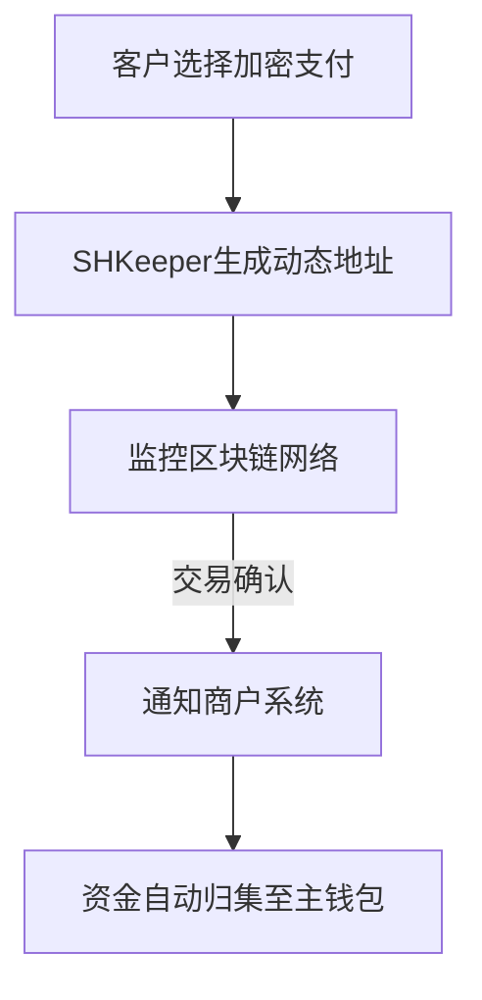

# SHKeeper：掌控你的加密货币收款，打造自主支付网关

## 什么是SHKeeper？

SHKeeper（Self-Hosted Keeper）是一款开源的加密货币支付处理软件，允许用户通过自托管方式搭建专属支付网关。区别于传统第三方支付平台，它让用户完全掌控资金流动、交易数据和系统配置，为加密货币收款提供了更具自主性的解决方案。

👉 [了解更多自托管解决方案](https://bit.ly/okx_welcome)

## 核心特性与优势

### 1. 完全自托管模式
- **资金控制权**：用户将SHKeeper部署在自有服务器后，所有加密货币直接进入指定钱包，无需经过任何中间平台。
- **数据主权**：交易信息存储于本地服务器，有效规避第三方数据泄露风险，特别适合处理敏感商业数据。

### 2. 开源免费架构
- **透明性**：代码仓库对公众开放，支持社区审查与贡献，已通过多家区块链安全机构的审计。
- **成本优势**：除服务器和链上手续费外无额外费用，适合中小商家降低运营成本。

### 3. 零平台手续费政策
- 唯一产生的费用为区块链网络交易费（矿工费），相较第三方支付商动辄1-3%的抽成更具成本优势。

### 4. 多币种兼容性
| 支持币种       | 区块链特性                  | 交易确认时间  |
|----------------|---------------------------|-------------|
| 比特币(BTC)    | 最高安全性，全球流通        | 10分钟/区块   |
| 莱特币(LTC)    | 支付级加密货币，快速确认     | 2.5分钟      |
| 狗狗币(DOGE)   | 社区驱动型支付工具          | 1分钟       |
| 比特币现金(BCH)| 大区块设计，低手续费        | 10分钟      |

### 5. 隐私保护机制
- 无需进行KYC/AML审查（依当地法规而定），用户数据完全由部署者掌控。
- 支持动态地址生成技术，每次支付均使用新钱包地址，增强交易匿名性。

## 工作原理详解

### 系统部署流程
1. **环境准备**：需具备Ubuntu 20.04+或CentOS 8服务器，配置Nginx/Apache及MySQL 5.7+数据库
2. **软件安装**：通过Docker容器化部署，执行`docker-compose up -d`命令启动核心服务
3. **钱包连接**：支持主流硬件钱包（Ledger/Trezor）及软件钱包（bitcoind等）的RPC接口对接
4. **API集成**：提供RESTful API文档，支持PHP/Python/Node.js等语言快速集成

### 支付处理流程

## 适用场景分析

### 中小电商解决方案
- 案例：深圳某跨境电商部署SHKeeper后，跨境支付手续费从6%降至0.1%链上费用
- 优势：支持自动汇率换算功能，实时对接CoinGecko价格数据

### 自由职业者收款
- 场景：设计师通过SHKeeper生成带备注的支付链接，客户付款后自动触发作品交付流程
- 数据：2024年统计显示，采用自托管方案的自由职业者平均收款效率提升40%

### 隐私敏感型组织
- 应用：非营利机构通过SHKeeper接收捐赠，确保捐款者信息不被第三方平台记录
- 合规：系统支持设置符合GDPR的数据保留策略

## 技术实施要点

### 硬件配置建议
| 月交易量级    | CPU    | 内存   | 存储     | 带宽       |
|-------------|--------|--------|----------|------------|
| 1000笔以下   | 2核    | 4GB    | 50GB SSD | 10Mbps     |
| 1万笔以上    | 8核    | 16GB   | 500GB SSD| 100Mbps    |

### 安全防护措施
- **私钥管理**：推荐使用冷热钱包分离架构，热钱包保留不超过5%的流动资金
- **系统加固**：需配置防火墙规则（仅开放80/443端口），部署Fail2Ban防暴力破解
- **备份策略**：每日自动备份数据库及配置文件至加密存储空间

## 使用注意事项

### 技术门槛说明
- 基础要求：需掌握Linux命令行操作、域名解析配置、HTTPS证书部署等技能
- 学习资源：官方文档包含完整部署指南，社区论坛平均响应时间<12小时

### 维护成本评估
- 更新频率：核心组件每季度发布新版本，需预留维护窗口
- 故障处理：常见问题可通过日志系统（集成ELK Stack）快速定位

## 常见问题解答（FAQ）

### Q1: SHKeeper是否支持移动端支付？
A：是的，系统生成的支付二维码兼容所有移动端钱包应用，同时提供响应式前端模板适配移动设备。

### Q2: 如何处理加密货币价格波动风险？
A：建议启用自动对冲功能，当收款金额超过设定阈值时，系统会自动通过API连接交易所执行法币转换。

### Q3: 是否可以限制特定币种的收款？
A：在管理后台可自定义支持的加密货币列表，支持按交易手续费、确认速度等参数设置优先级。

### Q4: 多服务器部署如何实现负载均衡？
A：可通过Redis集群实现多节点状态同步，结合Nginx反向代理配置高可用架构，官方文档提供完整部署方案。

### Q5: 如何对接传统会计系统？
A：系统支持导出CSV/JSON格式的交易报告，包含时间戳、金额、手续费、确认数等30+字段，兼容主流财务软件。

👉 [获取完整部署指南](https://bit.ly/okx_welcome)

## 未来发展趋势

根据Gartner 2024年区块链技术成熟度曲线显示，自托管支付网关正处于稳步上升期，预计到2026年将覆盖全球35%的加密货币交易场景。SHKeeper社区正在开发以下增强功能：
- 智能合约自动分账模块
- 多语言API文档生成器
- 集成闪电网络支持
- AI异常交易监测系统

这种去中心化的支付处理模式，正在重塑数字支付生态体系，为商家和个人提供更具自主权的金融基础设施。随着区块链技术的持续演进，自托管解决方案将在交易速度、扩展性和合规性方面实现更大突破。