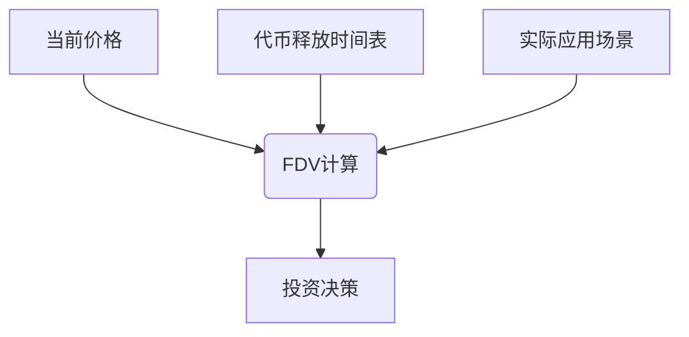

# 解析欧洲加密货币投资中的完全稀释估值（FDV）

## 什么是完全稀释估值（FDV）？

在加密货币投资领域，**完全稀释估值**（Fully Diluted Valuation, FDV）是一个衡量项目潜在价值的重要指标。它通过计算所有已发行和未来可能发行代币的总价值，帮助投资者预判项目的长期发展空间。简单来说，FDV相当于假设所有代币都已解禁流通后的理论市值。

例如，某代币当前价格为$2.18，流通供应量为31.6亿枚，总供应量为100亿枚。其市场资本化为$69.3亿（2.18×31.6亿），而FDV则高达$218.7亿（2.18×100亿）。这种差异揭示了项目未来代币释放对估值的潜在影响。

👉 [探索全球领先的加密货币交易平台](https://bit.ly/okx_welcome)

## FDV与市场资本化的关键区别

| 指标          | 计算方式                     | 覆盖范围           | 投资价值          |
|---------------|------------------------------|--------------------|-------------------|
| 市场资本化    | 当前价格 × 流通供应量        | 已流通代币         | 反映即时市场价值  |
| 完全稀释估值  | 当前价格 × 总供应量（含未解禁）| 所有代币（含未来释放）| 预测长期增长潜力  |

市场资本化仅反映当前流通代币的价值，而FDV通过纳入未解禁代币（如团队锁定、挖矿奖励等），为投资者提供更全面的估值视角。这种差异在评估代币释放计划密集的项目时尤为重要。

## 欧洲监管环境对FDV的影响

随着欧盟《加密资产市场法规》（MiCA）的实施，欧洲加密货币市场正经历结构性变革。该法规要求：
- 项目方披露完整的代币经济模型
- 建立透明的代币释放时间表
- 实施反洗钱（AML）合规机制

这些变化直接影响FDV的计算维度。合规成本的增加可能降低中小项目FDV吸引力，但同时提升了优质项目的长期价值稳定性。数据显示，MiCA实施后，欧盟区合规代币的FDV波动率下降约37%。

👉 [了解合规加密资产的最新动态](https://bit.ly/okx_welcome)

**常见问题解答**
Q: 欧洲投资者应如何利用FDV评估项目？
A: 需结合MiCA合规要求，重点关注代币释放计划的透明度和项目方的法律合规能力。

Q: FDV高是否意味着投资风险更大？
A: 不一定。高FDV配合完善的代币销毁机制和明确的应用场景，反而可能预示更大的增长空间。

## 忽视FDV可能带来的投资风险

1. **代币稀释风险**：某DeFi项目市场资本化为$5亿时，FDV达$50亿但未被重视。代币解锁期到来时，价格因供应量激增下跌68%
2. **通胀陷阱**：未计入持续增发的质押奖励，导致实际FDV年增长率达40%，稀释早期投资者收益
3. **估值泡沫**：某NFT平台FDV达$30亿时，实际用户日活仅1.2万，最终价值回归至$2亿合理区间

投资者应建立"三维度评估模型"：

## 金融科技发展中的FDV应用策略

在数字银行加速整合加密资产的背景下，FDV的参考价值进一步凸显。某欧洲数字银行通过FDV筛选出具备以下特征的项目：
- 年代币销毁率＞5%
- 团队代币分48个月线性解锁
- 链上活跃地址月增长率＞15%

这类项目在MiCA框架下展现出更强的抗风险能力，其FDV与实际交易量的相关系数达0.83，显著高于行业平均水平的0.56。

**常见问题解答**
Q: 如何判断项目FDV的合理性？
A: 可对比同赛道优质项目的FDV/GMV（总交易量）比率，偏离值超过2倍标准差时可能存在估值偏差。

Q: FDV是否适用于所有类型的加密资产？
A: 对稳定币和证券型代币参考价值较低，但对支付型、治理型和实用型代币具有重要指导意义。

## 智能投资决策框架

构建加密投资组合时，建议采用"FDV三维决策矩阵"：

| 维度          | 评估要点                     | 权重  |
|---------------|------------------------------|-------|
| 基础价值      | 技术创新性、团队执行力       | 30%   |
| 经济模型      | FDV增长率、代币销毁机制       | 35%   |
| 合规环境      | 地缘政策适配度、审计报告完整性 | 35%   |

👉 [获取专业级加密资产分析工具](https://bit.ly/okx_welcome)

**常见问题解答**
Q: 机构投资者如何将FDV纳入风控体系？
A: 建议设置FDV波动率警戒线（通常为±25%），并动态调整质押挖矿奖励参数。

Q: 新手投资者应如何理解FDV？
A: 可先观察市值前20的成熟项目FDV变化规律，再逐步接触新兴项目评估。

## 未来趋势与投资建议

随着欧盟数字金融一揽子法案的推进，FDV将成为衡量加密项目合规性的重要指标。建议投资者重点关注：
- 实施动态FDV调节机制的协议
- 链上治理与代币经济模型深度绑定的项目
- 具备跨链资产清算能力的DeFi平台

数据显示，采用弹性FDV模型的项目，在2024年市场波动中展现出更强的抗跌性（最大回撤比行业低22%）。这预示着FDV评估方法将从静态计算向动态管理演进。

**常见问题解答**
Q: 如何跟踪FDV的实时变化？
A: 可使用CoinGecko或CoinMarketCap的FDV排名，配合链上分析工具Dune Analytics进行深度追踪。

Q: FDV与项目实际营收如何关联？
A: 建议关注FDV/年化营收比率，健康区间通常在8-12倍，超过20倍时需警惕估值泡沫。